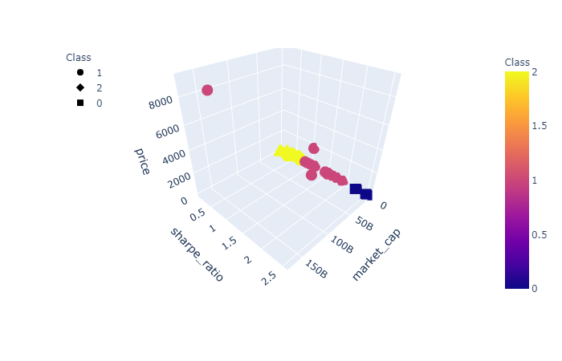

# Project-2 Crypto Robo Advisor

## Project summary

* Financial experts and studies affirm that cryptocurrencies have a useful role in the optimal portfolio construction and in investments, in addition to their original purposes for which they were created.

* A universe of cryptocurrencies is available to investors through online broker platform around the world.

* A Robo Advisor building cryptocurrencies portfolios based on risk profiles can help retail investor to gain broad exposure to this new asset class in a secure and diversified way.

* Clustering through the Spectral Clustering machine learning algorithm allows to assign a risk score to each cryptocurrency group.

* We created AWS Chatbot to analyze clients’ requests and assign risk profiles based on our investment suitability questionnaire. The Robo Advisor then offers an optimal cryptocurrency portfolio for each investment risk profile.

## Data Cleanup and Preparation

* After analyzing the available data from CoinMarketCap and the different exchanges from CCXT, we decided to use the free Kraken API to obtain the cryptocurrencies data. Kraken offered the largest number of coins and most up to date historical data for free. We filtered the coins based on their market capitalization and their historical data availability.

* The result was a cryptocurrencies sample of 29 coins with significant market capitalization and enough historical data for the machine learning models.  

* The goal of the data preparation process was to obtain enough significant features from the coins to run a comprehensive clustering. We determined that the most relevant features from the coins were:
    - Market Capitalization
    - Trading Volume
    - Circulating supply as measured of mining activity
    - Standard Deviation
    - Sharpe Ratio
    
* The above-mentioned features were reduced to 3 Principal Components and the data was ready for the Spectral clustering algorithm and the SVM.

## Model Evaluation & Training

* In order to assign a risk ranking to the cryptocurrencies, the first step was to cluster them into comprehensive groups where we could visualize their key attributes and determine a risk score for each group.

* We decided to us Spectral clustering as the affinity, and not the absolute location, determines what points fall under which cluster. This was particularly useful because our data formed complicated shapes.

* We tested other clustering algorithms such as K-means and ran them with and without PCA.

* We then trained an SVM on the data using the cluster class as our label, to allow for easy assignment of new cryptocurrencies into our universe as they come online, rather than having to rerun the entire clustering.  

* The clustering was visually evaluated, comparing PCA vs raw data as inputs with the K-means and Spectral methods, to determine which gave us the most satisfactory risk ranking.

    - Spectral Clustering with PCA

.png)

    - Spectral Clustering witout PCA

    - K Means Clustering with PCA
    
.png)

* Lastly, our portfolio optimization model determines the best crypto allocation for the different portfolios which will be assigned to our clients based on their risk profiles.

* The resulting newly labeled data was fed into an SVM, using random oversampling, and the confusion matrix was used to evaluate the model’s predictive efficiency (hint: N was too small for robust training).

* After running the clustering model, the classification was merged with the existing DataFrame and the risk score was assigned. The resulting CSV was then pulled by the Lambda functions in AWS.

## AWS Chatbot

* The lambda function connects with the free Kraken API and the CSV file. It then retrieves the clustering results with the risk scores and the historical data.

* The Chatbot requests the following inputs from the clients:
    - Age (Birthday)
    - Retirement age
    - Income
    - Investment amount
    - Risk aversion

* Based on clients’ inputs, the Chatbot assigns a risk score. This risk score will result in a specific crypto portfolio obtained from our classification analysis and portfolio optimization model.

* Finally, the Chatbot provides additional information (returns, weights, etc.) regarding the assigned portfolio.

## Project Slides & Video
https://docs.google.com/presentation/d/1-us-9DCNJS6rHbjeXjF_qEYnYJfelcVdhAOizfgPVA4/edit?usp=sharing
